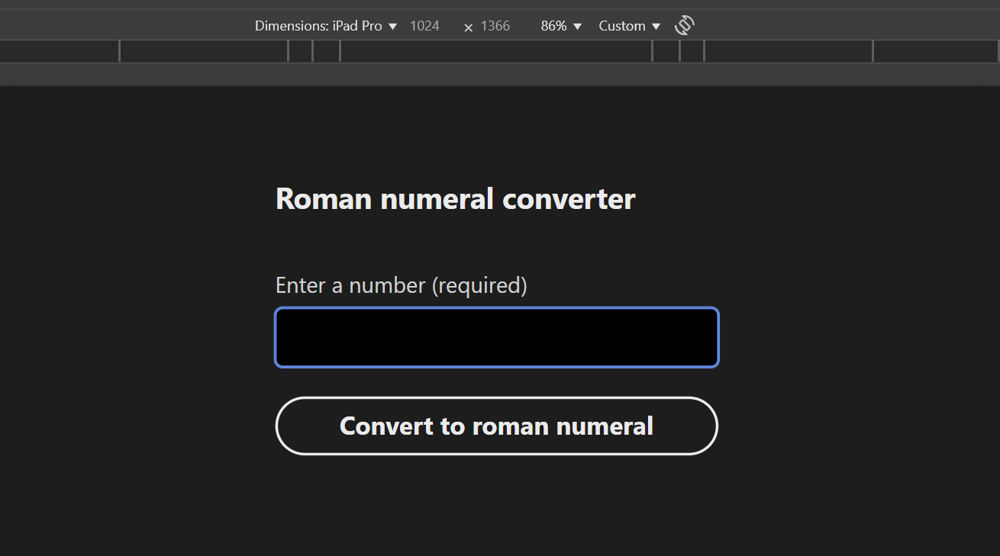
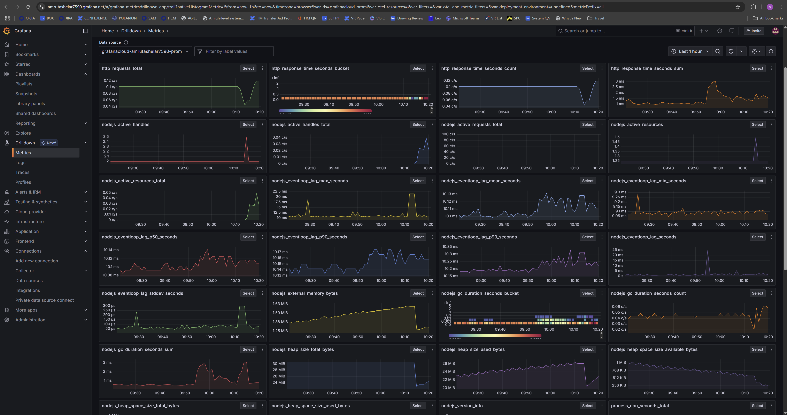
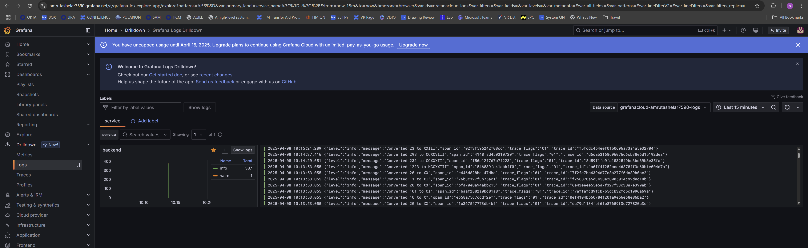
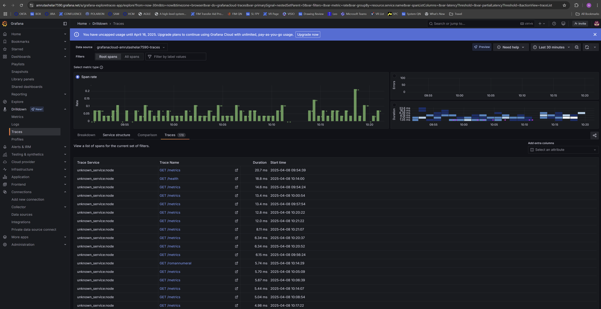

##  Overview

**GenStudio Roman Numeral Converter** is a fully responsive, accessible, and Dockerized full-stack web application built as part of the **Adobe GenStudio Engineering Assessment**.

This tool allows users to convert standard Arabic numerals (from **1 to 3999**) into their Roman numeral equivalents with real-time validation and robust error handling. It features a streamlined UI built with **Adobe React Spectrum**, ensuring accessibility and consistency across platforms.

---

##  Features & Functionality

-  **Live conversion**: Enter a number and get the Roman numeral instantly.
-  **Smart validation**:
     - Frontend: catches invalid, missing, or out-of-range input before sending to the backend.
      - Backend: double-validates and ensures data integrity before processing.
-  **Error feedback**: Clearly separates user input errors vs. system/server errors.
-  **Built with accessibility in mind**: ARIA roles, keyboard support, focus traps, and screen reader hints.
-  **Keyboard-ready**: Submit via `Enter` key with smooth feedback and no page reload.
-  **Dockerized**: Run everything — frontend, backend, tests, and observability — in containers.
-  **Fully observable**: Metrics, logs, and traces all shipped to Grafana Cloud via Grafana Agent.

---
##  Architecture & Key Features

- **Frontend**:  
  Built with **React** and styled using **Adobe React Spectrum**, leveraging its accessible design system and ARIA-first approach. Supports client-side validation, form state management, and dynamic feedback rendering via `InlineAlert`.

- **Backend**:  
  A lightweight **Express.js** server exposes a `/romannumeral` endpoint that performs type-checking, range validation, and Roman numeral conversion logic using a pure utility module. Errors are returned in a standardized JSON schema to support structured error mapping on the frontend.

- **Observability Stack**:  
  - **Prometheus** (metrics)
  - **Loki** (logs)
  - **Tempo** (traces)  
  All instrumented using **Grafana Agent** with remote write configuration, enabling real-time monitoring in Grafana Cloud.

- **Test Coverage**:
  - Backend: Unit and integration tests with **Jest** + **Supertest**
  - Frontend: Component-level tests with **React Testing Library**
  - E2E: Functional tests using **Cypress**, simulating user interaction in a headless browser

- **Dockerized Services**:
  - Full support for `docker compose` to spin up frontend, backend, test runners, and observability agents in isolated containers.

- **Error Handling Architecture**:  
  - The frontend implements **manual error handling** without a traditional `ErrorBoundary`. Instead, it cleanly separates:
    - `inputError`: for client-side validation errors (e.g., empty, out-of-range, or non-numeric input)
    - `serverError`: for server-side errors, timeouts, or network failures
  - Feedback is rendered using accessible `InlineAlert` components, with `aria-live` regions and keyboard focus management to ensure screen reader and keyboard support.
  - Edge cases such as timeouts, offline state, unexpected HTTP responses, and malformed payloads are caught and displayed with appropriate fallback UI.

---

##  Device & Browser Support

This app is built with **responsive design** in mind and tested on:

- ✅ Desktop browsers (Chrome, Firefox, Safari, Edge)
- ✅ Tablet (iPad, Surface)
- ✅ Mobile (iOS Safari, Android Chrome)
- ✅ Screen readers + keyboard navigation

It adapts to light/dark mode based on system preferences.

###  Browser Compatibility

This app has been tested and works reliably on:

- ✅ **Google Chrome** — Version **90 and above**
- ✅ **Safari** — Version **13 and above**

It leverages modern browser features like `fetch`, `async/await`, and system theme detection (`prefers-color-scheme`), which are supported in all the above versions.


---

##  Screenshots

###  Light Mode 
#### Desktop 


#### Tablet


#### Mobile


###  Dark Mode 
#### Desktop 


#### Tablet




#### Mobile


---

##  How to Run This App Locally (via Docker)

This project is fully containerized. Follow the steps below to clone, build, and run it from scratch.


### ✅ Prerequisites

Make sure the following are installed **before proceeding**:

- [Docker Desktop](https://www.docker.com/products/docker-desktop/)
- [Git](https://git-scm.com/downloads)

---

###  Step 1 — Clone the Repository

```bash
git clone https://github.com/diva354/genstudio-app.git
cd genstudio-app
```
---
###  Step 2 — Build & Start the App

Use Docker Compose to spin up all services:

```bash
docker compose up --build
```

This will automatically build and start:

| Service         | Description                                 |
|-----------------|---------------------------------------------|
| `frontend`      | React app (UI) on port **3000**             |
| `backend`       | Express API on port **8080**                |
| `grafana-agent` | Pushes metrics/logs/traces to Grafana Cloud |

---

### **Step 3 — Access the Running App**

Once running, open your browser:

-  **Frontend App** → [http://localhost:3000](http://localhost:3000)
-  **API Endpoint** → [http://localhost:8080/romannumeral?query=10](http://localhost:8080/romannumeral?query=10)
-  **Metrics Endpoint** → [http://localhost:8080/metrics](http://localhost:8080/metrics)
-  **Health check Endpoint** → [http://localhost:8080/health](http://localhost:8080/health)
---

### **Step 4 — Run Backend & Frontend Tests (Optional)**
#### About Testing Setup

This project supports multiple levels of automated testing:

- ✅ `docker compose up backend-tests frontend-tests` runs:
  - **Backend unit + integration tests** (via Jest & Supertest)
  - **Frontend component tests** (via React Testing Library)

> ⚠️ **Note:** End-to-end tests using **Cypress** are **not** included in the Docker Compose test containers.  
> You’ll need to run them manually using the instructions below.

To run all tests inside Docker:

```bash
docker compose up backend-tests frontend-tests
```

- ✅ Backend unit tests via **Jest + Supertest**
- ✅ Frontend component tests via **React Testing Library**

---
### 🧪 Manually Running Cypress (End-to-End) Tests

To run Cypress tests manually and interactively on your machine:

####  Prerequisites

- Make sure the app is running (via Docker or locally):

```bash
docker compose up
```
This starts the frontend on http://localhost:3000

####  Run Cypress UI

Inside the `frontend` folder:

```bash
cd frontend
npx cypress open
```
This opens the Cypress Test Runner UI where you can pick and run individual test files.

####  Headless Mode (Optional)

To run tests in headless mode:

```bash
npx cypress run
```

####  Notes

- Cypress base URL is configured to point to `http://localhost:3000`
- Ensure the backend service is also running for all integration tests to pass
- All E2E tests are located inside `frontend/cypress/e2e/`

---

###  **Step 5 — Built-in Observability**

This app includes full observability out-of-the-box:

| Signal   | Tool                   | Notes                                                  |
|----------|------------------------|--------------------------------------------------------|
| Metrics  | Prometheus             | via `/metrics`, scraped by Grafana Agent              |
| Logs     | Winston → Loki         | Structured logs via log file, scraped by Grafana Agent |
| Traces   | OpenTelemetry → Tempo  | Express auto-instrumented spans                        |

All observability data is streamed to **Grafana Cloud** using a preconfigured `agent-config.yaml`.

---

###  Using the Example Config

This project includes a redacted `agent-config.example.yaml` file for safe public sharing.

To enable observability features (metrics, logs, traces):

1. **Duplicate the example file:**

   ```bash
   cp agent-config.example.yaml agent-config.yaml
   ```
2. **Edit `agent-config.yaml`** and replace the following placeholders with provided Grafana Cloud credentials:

   - `PROVIDED_PROM_USERNAME`
   - `PROVIDED_PROM_PASSWORD`
   - `PROVIDED_LOKI_USERNAME`
   - `PROVIDED_LOKI_PASSWORD`
   - `PROVIDED_TEMPO_USERNAME`
   - `PROVIDED_TEMPO_PASSWORD`
  
   
with your own **Grafana Cloud credentials**, which you can find on the **Prometheus**, **Loki**, and **Tempo** connection pages in your Grafana Cloud account.

---

###  **Notes**

- ✅ All environment-specific secrets are embedded for review (no manual setup required)
- 📄 Winston logs are stored at `/var/log/backend/app.log` and tailed by the Grafana Agent
- 🔗 Trace data is sent to Tempo using OpenTelemetry over OTLP (HTTP)

### **Screenshots**
 Prometheus Metrics

 

 Loki Logs

 

 Tempo traces

 

 

---

<details>
<summary> <strong>Assumptions, Decisions & Trade-offs</strong></summary>

<br/>

###  Manual Error Handling vs. React Error Boundaries

- **Decision**: The application handles all errors manually via controlled state (`inputError`, `serverError`) instead of using a React `ErrorBoundary` component.
  
- **Rationale**:  
  - Manual error handling allows for more granular, contextual UX — enabling the UI to surface specific feedback (e.g., form validation vs. system errors) without a full component fallback.
  - All predictable failure scenarios are proactively handled through `try/catch`, frontend validation, network monitoring, and structured error responses from the backend.
  - While `ErrorBoundary` is a powerful pattern for catching *render-time exceptions*, it is most beneficial in **large-scale or critical applications** where crashes are unpredictable and global fallback UIs are necessary.
  - In this focused, deterministic app with a tightly scoped UI, the likelihood of uncaught render errors is low, and `ErrorBoundary` was deemed **unnecessary overhead**.

- **Trade-off**:  
  - Any true render exception will currently bubble up to the console or crash the component, rather than being caught by a global fallback.
  - However, since all meaningful user-triggered errors are anticipated and safely handled, this approach reduces complexity while still maintaining reliability and user experience.
  
> _“A React `ErrorBoundary` could be added in the future to support crash recovery or log unhandled render exceptions. For this use case, full manual error handling was sufficient and more flexible for UI feedback.”_

---

###  Testing Strategy Simplification
- The focus of this project was on **functional correctness**, error handling, and backend-frontend integration — rather than visual UI or pixel-perfect rendering.
- Therefore, the test strategy emphasized:
  - ✅ **Unit tests** for core logic (e.g., Roman numeral conversion)
  - ✅ **Integration tests** for backend routes using Supertest
  - ✅ **Component-level tests** for interactive UI behavior using React Testing Library
  - ✅ **End-to-end tests** with Cypress to simulate real user flows

- **Assumption**: 
   - **Snapshot testing** was intentionally omitted in this scope to avoid brittle tests tied to visual structure or styling. Since the project emphasizes **robustness, observability, and correctness** over pixel fidelity, snapshot testing or CSS assertions were not prioritized.
   - **Mocked API avoidance in Cypress**:  
        - In Cypress, API requests were **not mocked** in order to preserve the integrity of **true backend integration**.
        - By allowing requests to hit the actual Express backend, tests validate the **full system stack**: client-side logic, server validation, route behavior, and response mapping.
        - This approach ensures that frontend logic stays in sync with backend contract, avoids stubbing drift, and catches real-world issues like timeout behavior, HTTP status codes, and malformed responses.

- **Trade-off**:
   -  **Mocked API avoidance in Cypress**
        - Mocking can speed up tests and isolate frontend behavior, but may lead to **false positives** when backend behavior or validation logic changes.
        - For this application, **real API interaction better reflects user behavior** and system integration goals.
   - **Snapshot testing**
     - In a more **UI/UX-driven or theming-focused** application — such as a design system or heavily styled interface — **snapshot testing would be a valuable addition**.
     - This would allow visual regressions to be caught early, especially in themes like **dark mode**, which responds dynamically to system preferences.

---

###  Dockerized Setup Trade-offs

- Decision to containerize observability stack (Prometheus, Loki, Tempo) adds minor complexity, but ensures fully portable telemetry without needing local installs.
- Required extra config (`agent-config.yaml`), which has been redacted and replaced with a public-safe template.

---
###  Choosing Grafana Labs for Observability

- **Decision**:  
  The observability stack for this project is built entirely on **Grafana Labs offerings** — using **Prometheus** (metrics), **Loki** (logs), and **Tempo** (traces), all integrated via the **Grafana Agent**.

- **Rationale**:
    - Grafana Labs provides a **one-stop, cloud-hosted solution** for all three pillars of observability — making it ideal for a unified, centralized telemetry experience.
     - Instead of stitching together separate tools, Grafana Cloud enables:
       - 🚀 **Unified dashboards** for real-time system insight  
       - 📈 Easy correlation between logs, metrics, and traces  
       - 🔐 Secure, token-based cloud ingestion with centralized control
     - While integrating the **Grafana Agent** required some up-front YAML config and cloud token setup, it provided:
       - Lightweight agents inside Docker  
       - Standardized push-based architecture for container logs and telemetry  
       - Easy scaling and visualization through Grafana’s cloud UI
     - All signals (Prometheus → `/metrics`, Winston logs, and OpenTelemetry spans) are routed through this agent for a fully instrumented environment.

- **Tracked Metrics**:
  - `http_requests_total` — total HTTP requests, labeled by:
    - `method` (e.g. GET)
    - `route` (e.g. /romannumeral)
    - `statusCode` (e.g. 200, 400, 500)
  - `http_response_time_seconds` — histogram of API response durations:
    - Measures request latency with defined time buckets (e.g. 0.1s, 0.5s, 1s, etc.)
    - Labeled by `method`, `route`, and `statusCode`
    - Used to monitor API performance over time
  - These are exported using **Prometheus client** and exposed on the `/metrics` route.
 
- **Structured Logs** (via `winston`):
  - Each log entry includes:
    - `level` (info, warn, error)
    - `timestamp`
    - `message`
  - Logs are persisted to `/var/log/backend/app.log` and picked up by Grafana Agent to be shipped to **Loki**.

  Example log entries:
  ```json
  {
    "level": "info",
    "message": "Converted 10 to X",
    "timestamp": "..."
  }

  {
    "level": "warn",
    "message": "Invalid input - out of range",
    "timestamp": "..."
  }
  ```
  - **Traces** (via OpenTelemetry):
  - Auto-instrumented using the **OpenTelemetry Node SDK**
  - Captures:
    - HTTP request spans including:
      - `method`
      - `route`
      - `status`
      - `latency`
    - Custom trace metadata such as:
      - `service.name`
      - `http.status_code`
      - `http.target`
  - Exported to **Tempo** using OTLP over HTTP and viewable in **Grafana Cloud’s Traces dashboard**
 
    
- **Trade-off**:
  - Compared to local self-hosted tools, Grafana Cloud requires API token management and redacting secrets for public repos.
  - However, the **long-term benefit of having all observability in one place**, with minimal infrastructure overhead, makes Grafana Labs a compelling choice — especially for a production-style setup.

> _“Grafana Labs helped consolidate observability tooling, streamline debugging, and visualize application health in real-time — making it worth the integration effort upfront.”_

---

###  Health Check Endpoint

- **Decision**:  
  A lightweight `/health` route was added to the backend service to verify basic availability. This supports health monitoring via Docker, uptime tools, or load balancers.

- **Rationale**:
  - Provides a simple **liveness check** to confirm that the server is responsive.
  - Enables **Docker healthchecks**, auto-recovery behavior, and monitoring integrations.
  - Returns a JSON object with service uptime and server timestamp — sufficient for lightweight observability in containerized setups.

- **Trade-off**:
  - The current health check does not verify deeper dependencies (e.g., database connectivity, downstream services, memory usage).
  - In a production environment, you’d typically implement:
    - **Readiness checks** (`/readiness`) — to ensure the app is fully initialized before accepting traffic
    - **Liveness checks** (`/liveness`) — to detect hangs or memory issues
    - **Dependency checks** — for database/API connection status or rate-limited third-party services
    - **Probes for external metrics** — like heap usage, disk space, or GC behavior

> _The `/health` route covers the essentials for this app's scope, while leaving room for deeper system awareness in a full production deployment._
---
###  Accessibility First Approach

- Assumed the app would be used by a wide range of users, including screen reader and keyboard users.
- Chose Adobe React Spectrum for its built-in ARIA support and WCAG-compliant design tokens.

</details>

---
##  Optional: Future Improvements  

###  Add Client-Side Metrics Collection

- **Motivation**:  
  While backend metrics (e.g. request count, response time) give valuable visibility into server performance, they do **not capture latency introduced by network delays** or issues on the client side — especially when serving a global user base.

- **Optimization Idea**:  
  Implement **client-side performance monitoring** to track:
  - Time to first byte (TTFB)
  - Total request/response round-trip latency
  - Render time of key UI components
  - JavaScript execution errors or slowdowns

- **How It Helps**:
  - Distinguish whether bottlenecks are happening on:
    - The **server** (e.g. slow business logic or database)
    - Or the **client side / network** (e.g. CDN latency, user’s poor internet, geographic delays)
  - Helps make smart decisions around:
    - Using a **CDN or edge cache**
    - Deploying **geo-distributed infrastructure**
    - Adding **client-specific observability tooling** (e.g., Sentry, Google Analytics, or a custom Prometheus/Grafana panel for frontend metrics)

- **Possible Tools**:
  - `web-vitals` (for LCP, FID, CLS)
  - `performance.now()` API
  - Browser APIs for resource timing and navigation timing
  - Client-side Prometheus-compatible exporters (or custom push to backend)

> _This would elevate the app from backend-only observability to **full-stack performance insight**, improving UX and performance debugging for users across the globe._
